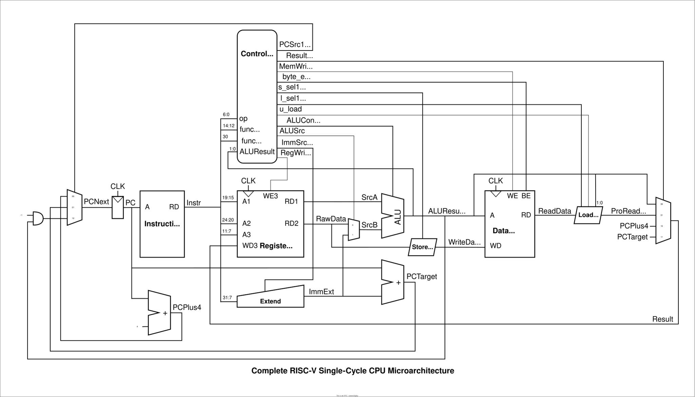

# 🧠 RISC-V Single-Cycle CPU (RV32I)

This project implements a **single-cycle RISC-V (RV32I) processor** in SystemVerilog HDL.  
The design fully supports the **base integer instruction set**, with clean modular separation between **datapath**, **control**, and **memory access units**.  

---

## Project Structure
- `rtl/` — Verilog Source Modules
- `sim/` — Testbenches
- `docs/` — Diagrams and Explanations

---

## 📘 Overview

This processor executes one instruction per clock cycle using a single-cycle microarchitecture.  
All instruction types (R, I, S, B, U, J) are supported, including arithmetic, logic, load/store, and branch operations.

### Key Features
- Implements **RV32I base ISA**
- Modular **datapath + control** separation
- **Dedicated Load and Store Units** for memory access
- **3:1 PC multiplexer** for next PC selection (`PC+4`, `PC+imm`, `imm(rs1)`)
- **4:1 writeback multiplexer** for register file input

---

## 🧩 Microarchitecture Diagram

*Figure 1. RV32I Single-Cycle CPU Microarchitecture with Control and Datapath Integration.*

---

## ⚙️ Major Blocks

### 🧮 Datapath
The datapath contains:
- **Program Counter (PC):** Holds current instruction address.  
- **Instruction Memory:** Provides instruction for current PC.
- **Data Memory:** Stores and loads data.
- **Register File:** 32 general-purpose registers (`x0–x31`), two read ports and one write port.  
- **ALU:** Performs arithmetic and logic operations.  
- **Extend Unit:** Extracts and sign-extends immediate fields.  
- **Load/Store Units:** Handle data alignment and masking for byte, halfword, and word accesses.  
- **PC Mux:** Selects next PC from PC+4, branch target, or jump target.  
- **Writeback Mux:** Selects source for register write data (ALU result, load data, PC+4, or PC+imm).

---

### 🧠 Control Unit
The control unit decodes the instruction opcode and generates control signals for the datapath.

#### Control Unit Inputs
| Signal      | Width | Description                                   |
|-------------|-------|-----------------------------------------------|
| `op`        | [6:0] | Instruction opcode field                      |
| `funct3`    | [2:0] | ALU operation subtype                         |
| `funct7b5`  |   1   | Used for distinguishing add/sub, shifts, etc. |
| `ALUResult` | [1:0] | Used for branch condition and byte-enable.    |

#### Control Unit Outputs
| Signal      | Description                                           |
|-------------|-------------------------------------------------------|
| `PCSrc`     | Selects PC source                                     |
| `ResultSrc` | Selects Result source (ALU, Data Memory, PC+4, PC+imm)|
| `MemWrite`  | Enables data memory write                             |
| `byte_en`   | Enables what bytes to write to during store operation.|
| `s_sel`     | Replicates bytes for data alignment                   |
| `l_sel`     | Chooses type of load operations                       |
| `u_load`    | Toggles unsigned load operations                      |
| `ALUControl`| 4-bit signal selecting ALU operation type             |
| `ALUSrc`    | Selects ALU operand source (register or immediate)    |
| `ImmSrc`    | Selects how to encode immediate value                 |
| `RegWrite`  | Enables register file write                           |

---

## 🧪 Simulation & Testing

- In progress

---

## 🚀 Future Work
- Add **RV32M** (multiply/divide) extension  
- Implement **five-stage pipelined** version  
- Add **hazard handling**  

---

## 📄 License
This project is open for educational and non-commercial use.  
Feel free to fork, explore, and extend.

---

*Author: jeffreyc-dev*  
*Senior ASIC Design Engineer*